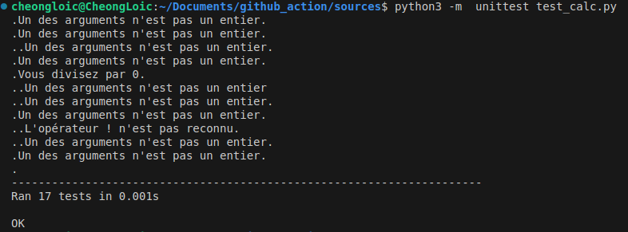

# github_action

Ce sert d'entrainement pour tester une pipeline CI/CD avec Gitub Actions.

On utilisera une programme python qui simulera une calculatrice qu'on valide avec des tests unitaires.

À l'aide des github actions, nous mettrons à jour notre calculatrice et nous exécuterons les tests.

Unit test at the terminal
- `python3 -m unittest test_calc.py`
